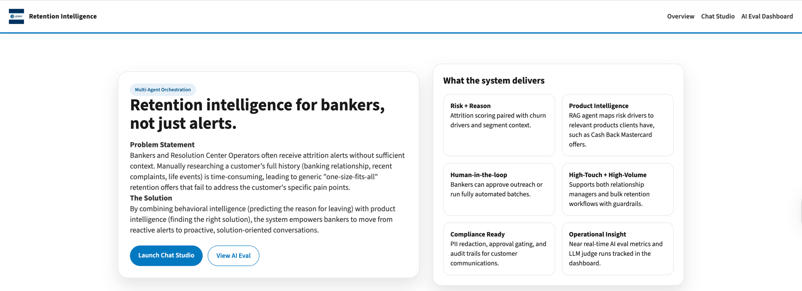

# Local System Setup (macOS)

This guide sets up the full stack locally on macOS.

## Prereqs
1. Install Homebrew if not installed.
2. Install Python and Node:
   - `brew install python`
   - `brew install node`
3. Install Docker Desktop (for Postgres).
4. Install Ollama:
   - `brew install ollama`
   - Start the daemon: `ollama serve`
   - Pull models:
     - `ollama pull llama3.2:latest`
     - `ollama pull nomic-embed-text:latest`

## Environment
1. Copy env templates:
   - `cp .env.example .env`
   - `cp frontend/.env.local.example frontend/.env.local`
2. Update Langfuse keys in `.env` if you have them.

## Backend
1. Create a virtual env and install deps:
   - `python -m venv .venv`
   - `source .venv/bin/activate`
   - `pip install -r backend/requirements.txt`
2. Start Postgres:
   - `docker compose -f docker-compose.yml up -d`
3. Start the API:
   - `uvicorn app.main:app --reload --port 8000 --app-dir backend`
   Note: `source .venv/bin/activate` is required to start the API.

## Frontend
1. Install deps:
   - `cd frontend`
   - `npm install`
2. Run dev server:
   - `npm run dev`
3. Open `http://localhost:3000`.

## Verify
- Chat Studio: `http://localhost:3000/chat`
- AI Eval Dashboard: `http://localhost:3000/dashboard`

## Demo

### Overview
The application landing page.

### Chat Studio
Interact with your data using natural language.

#### Identify At-Risk Customers
Query the system to find the top 10 customers at risk of churning.

#### Generate Retention Email
Generate a personalized retention email for a specific customer based on their profile.

### AI Evaluation Dashboard
Monitor the performance and quality of AI responses.

### LangFuse Integration
View traces and metrics in LangFuse.

