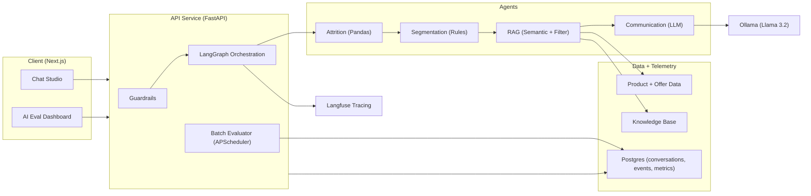

# Architecture: Retention Intelligence Assistant

## Overview
The system converts raw attrition signals into actionable banker guidance via a multi-agent LangGraph workflow, while capturing traces and evaluation metrics for continuous monitoring. The architecture is optimized for:
- High-context decisioning (why the customer might leave)
- Product-aware recommendations (what to offer)
- Safe, compliant interactions (guardrails)
- Observable performance (tracing + eval dashboards)

## Core Components
1. **API Service (FastAPI)**
   - Handles chat requests, orchestrates the LangGraph workflow, and logs telemetry.
   - Exposes `POST /api/chat` for synchronous responses and `POST /api/chat/stream` for Server-Sent Events (SSE).
   - Uses `apscheduler` for background batch evaluation jobs.
2. **LangGraph Orchestration**
   - Supervisor flow with chained agents: Attrition -> Segmentation -> RAG -> Communication.
   - Manages state including user input, customer context, retrieved documents, and generated drafts.
3. **Guardrails Layer**
   - Hybrid approach using Regex patterns for PII and Keyword + LLM classification for Jailbreak/Threat detection.
   - Redacts PII before storage/tracing and records audit events.
4. **Telemetry + Eval Metrics**
   - Structured events and messages stored in Postgres.
   - Batch evaluator runs every 5 minutes to compute compliance/completeness.
5. **Frontend (Next.js)**
   - Chat Studio (end-to-end testing)
   - AI Eval Dashboard (near-real-time metrics)
6. **Langfuse Tracing**
   - Per-request trace metadata for prompt/response inspection.

## Workflow Detail
```
User Request
  -> Guardrails (PII/Jailbreak/Threat)
  -> LangGraph
     1) Attrition: 
        - Mode A: Ranks top N at-risk customers (churn_risk_score).
        - Mode B: Selects single customer context.
     2) Segmentation: 
        - Rule-based assignment (e.g., High-Net-Worth, New-to-Bank) based on balance, tenure, complaints.
     3) RAG: 
        - Filters offers based on segment & attrition reason.
        - Semantic search against Knowledge Base & Offer Catalog.
     4) Communication: 
        - Generates structured response (Summary, Offers, Next Best Action).
        - Drafts emails and requires explicit approval for email output.
  -> Response + Telemetry
```

## Architecture Diagram


## Data Model
- `conversations`: conversation metadata (id, customer_id, timestamps).
- `chat_messages`: user and assistant messages with metadata.
- `events`: system events like guardrail blocks.
- `audit_trail`: PII redaction logs and security events.
- `ai_eval_metrics`: batch-evaluated compliance and completeness scores.
- `llm_judge_runs`: persisted LLM judge inputs/prompts/outputs for replay.

## Guardrails Implementation
- **PII detection**: Regex patterns for email, phone, SSN, credit cards. Redacts input before processing.
- **Jailbreak/Threat**: 
  - Keyword heuristics (fast fail).
  - LLM-based classification (contextual analysis).
- **Audit**: Redactions and blocks are logged to `audit_trail`.
- **Execution model (current implementation)**:
  - Single pass guardrail function runs PII detection, keyword checks, then LLM classification.
  - Blocking happens if jailbreak/threat is detected; PII is redacted for downstream handling.

## Telemetry + Evaluation
- **Tracing**: Langfuse integration for full trace visualization.
- **Metrics**:
  - **Compliance**: 1 - (guardrail blocks / total messages).
  - **Completeness**: Checks for presence of "retention_summary", "offers", "next_best_action" in response.
- **Storage**: Metrics computed in batches and stored in Postgres for dashboarding.
- **LLM Judge Runs**: Prompt/response and parsed JSON are persisted for replay and audit.

## LLM Judge Versioning (Scoring Function Objects)
To allow rollbacks and reproducible evaluations, LLM judge configurations are versioned in-repo.

Structure:
```
backend/scoring_functions/
  <scoring_id>/
    <version>/
      spec.json
      README.md
```

Each `spec.json` includes:
- `id`, `version`, `description`
- `prompt_template`
- `schema` (expected JSON)
- `model`

When evaluations run, the system records:
- `scoring_id`, `scoring_version`, and derived `scoring_revision` (hash)
- the **full input**, **prompt**, **raw output**, and **parsed output**
- timestamp (`scored_at`)

This makes every score reproducible and supports rollback by pinning a prior version or revision.

Current scoring functions:
- `completeness/v1`
- `compliance/v1`

## Technology Stack
- **Backend**: Python 3.11+, FastAPI, LangChain, LangGraph.
- **Database**: PostgreSQL (via `psycopg`).
- **LLM**: Ollama (running Llama 3.2 locally).
- **Task Scheduling**: APScheduler.
- **Observability**: Langfuse.

## Production Readiness Roadmap
1. **Data Integration**: Replace CSV/JSON loaders with real CRM/Transaction DB connections.
2. **Security**: Move secrets to Vault, implement RBAC, enable SSL.
3. **Scaling**: 
   - Move RAG to a dedicated Vector DB (pgvector/Pinecone).
   - Externalize LLM hosting (vLLM/SGLang or Cloud Provider).
   - Decouple Evaluator to a separate worker service.
4. **Model Improvements**: Fine-tune models for specific banking tone and policy adherence.
